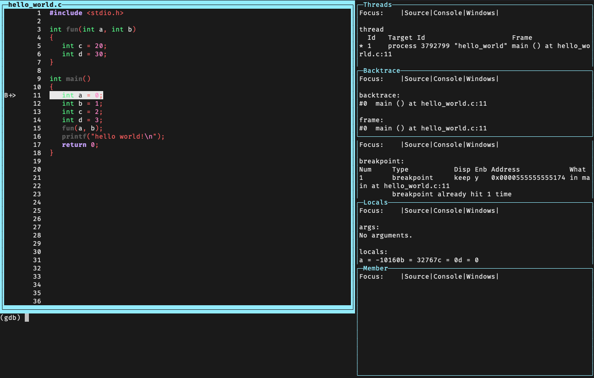

# gdb-conf
## Introduction
- Simple configuration for gdb

1. New gdb tui layout 'ide'

## Installation
### Prerequisite
```
sudo apt-get install libsource-highlight-dev
```

### gdb configure compile
```
./configure --with-gdb-datadir=[path-to-gdb]/gdb/data-directory --enable-targets=all --with-curses --with-python --enable-source-highlight
```

### ~/.gdbinit
```
source .../gdb-conf/source_py.py

set history save
set verbose off
set print pretty on
set print array off
set print array-indexes on
set python print-stack full
```

## Usage
- run gdb
- type `layout ide` in gdb

### 

## Screenshot

