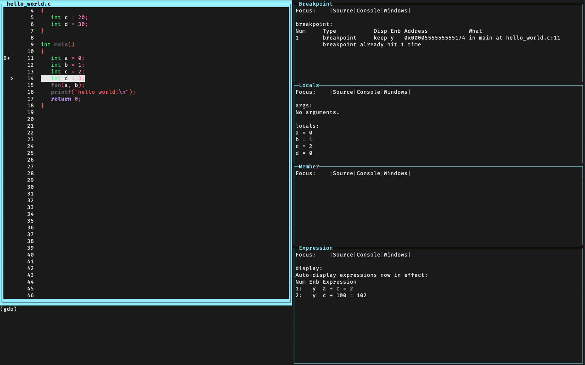

# gdb-conf
## Introduction
- Simple configuration for gdb

1. New gdb tui layout 'ide'
2. New command `attach-with-name` : attach gdb with process name
3. New module `gdb-attach` : python api related with attaching gdb

## Installation
### Prerequisite
```
sudo apt-get install libsource-highlight-dev libstdc++6 libncurses-dev
```
#### Python modules
```
psutil
pygment
```

### gdb configure compile
```
./configure --with-gdb-datadir=[path-to-gdb]/gdb/data-directory --enable-targets=all --with-curses --with-python=[path-to-python] --enable-source-highlight
```

### ~/.gdbinit
```
source .../gdb-conf/source_py.py

set history save
set verbose off
set print pretty on
set print array off
set print array-indexes on
set python print-stack full
```

## Usage
- run gdb
- type `layout ide` in gdb
- type `layout ide1` in gdb
- type `layout ide2` in gdb

## Screenshot


## Todo
- Fix directory path
- Fix source_py.py
- Wiki
